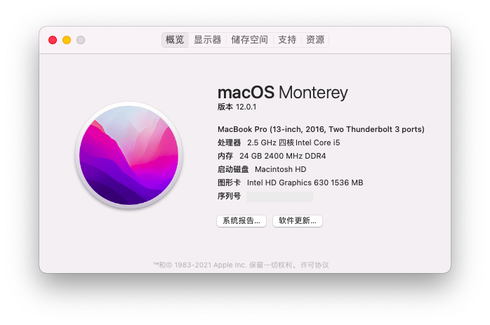
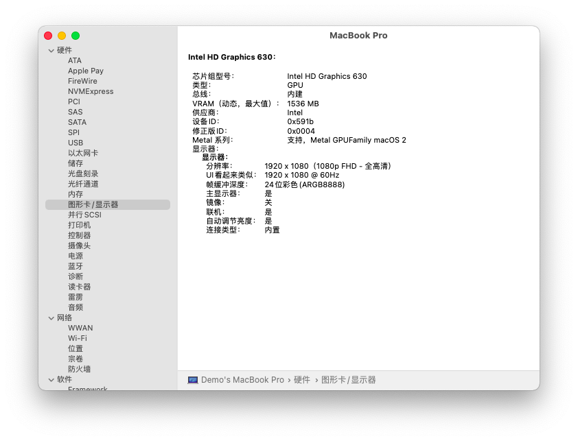
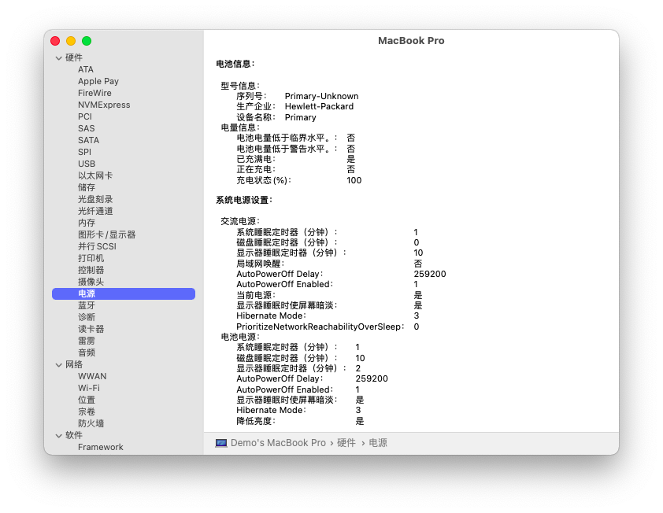
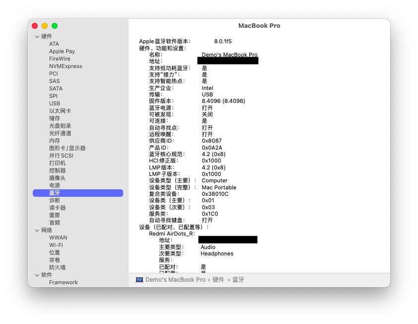
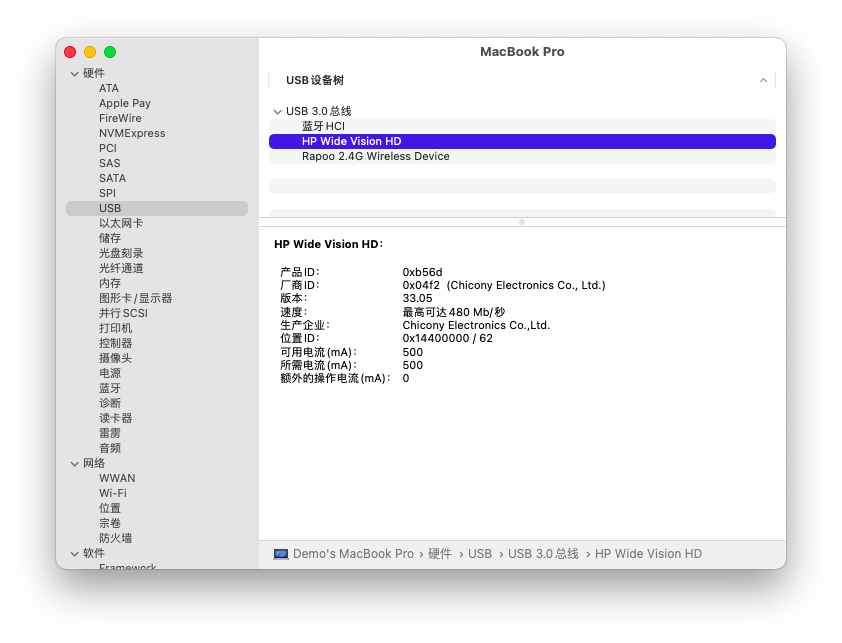
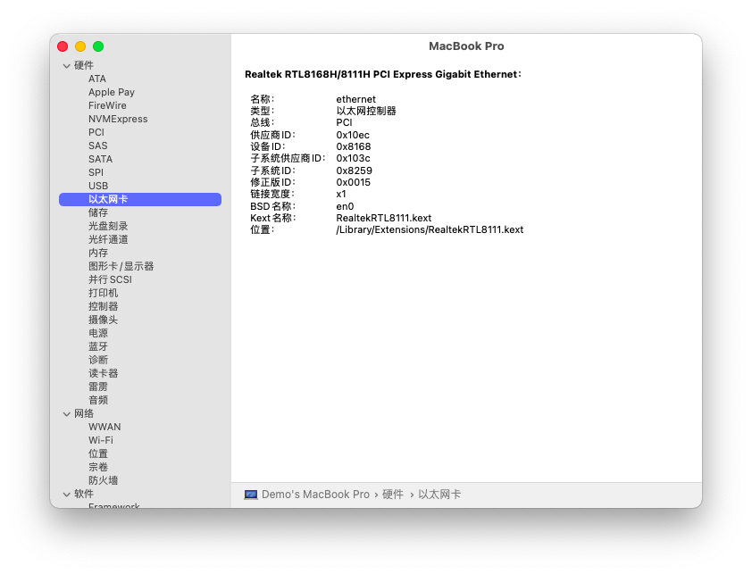
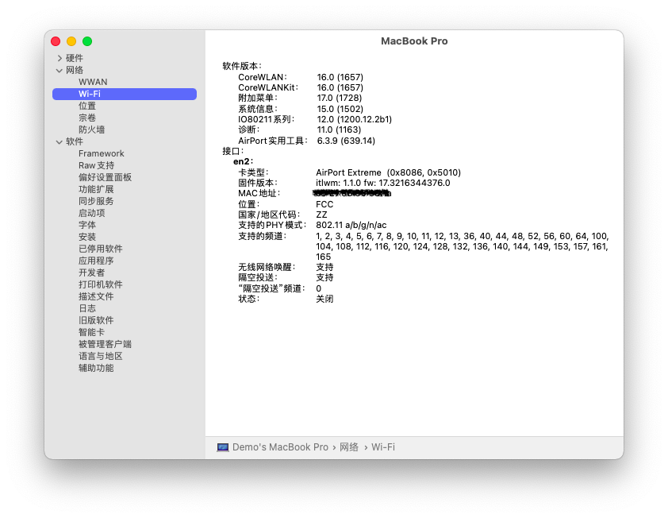
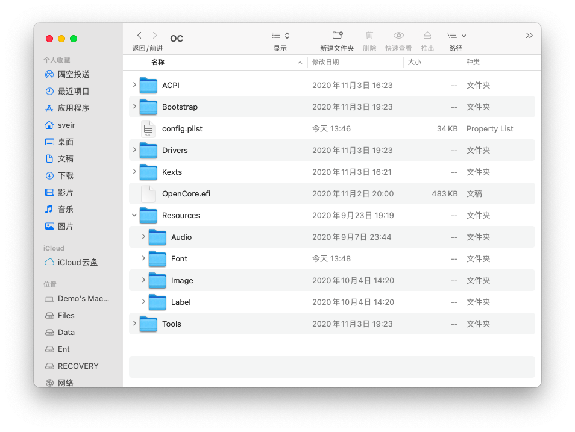

# OMEN-By-HP-15-ax225TX-Hackintosh-EFI | Sveir Dev.

<!-- PROJECT SHIELDS -->

```
 ______  __   __  ______    ________  ______        ______  ______  __   __           
/_____/\/_/\ /_/\/_____/\  /_______/\/_____/\      /_____/\/_____/\/_/\ /_/\          
\::::_\/\:\ \\ \ \::::_\/_ \__.::._\/\:::_ \ \     \:::_ \ \::::_\/\:\ \\ \ \         
 \:\/___/\:\ \\ \ \:\/___/\   \::\ \  \:(_) ) )_    \:\ \ \ \:\/___/\:\ \\ \ \  ___   
  \_::._\:\:\_/.:\ \::___\/_  _\::\ \__\: __ `\ \    \:\ \ \ \::___\/\:\_/.:\ \/__/\  
    /____\:\ ..::/ /\:\____/\/__\::\__/\\ \ `\ \ \    \:\/.:| \:\____/\ ..::/ /\::\ \ 
    \_____\/\___/_(  \_____\/\________\/ \_\/ \_\/     \____/_/\_____\/\___/_(  \:_\/ 
                                                                                 
```


<!-- PROJECT LOGO -->
<br />

<p align="center">
  <a href="https://github.com/sve1r/Rules-For-Quantumult-X/">
    
  </a>

  <h3 align="center">OMEN-By-HP-15-ax225TX-Hackintosh-EFI</h3>

  本仓库内容适用于暗影精灵 2 Pro 的 基于 OpenCore 的 Hackintosh EFI
   - 支持系统: macOS BigSur 11.1 (20C69)
   - OpenCore 版本: OpenCore Release v0.6.4 commit @7c5f19a
   - 最后更新日期: 2020-12-29

  **仓库内容归个人所有 转载请标明出处**
</p>


## 目录
- [🉑 简要说明](#🉑简要说明)
- [💻 当前机器配置](#💻当前机器配置)
- [⚙️ 当前情况](#⚙️当前情况)
- [🏙 预览图片](#🏙预览图片)
- [⚠️ 已知问题](#⚠️已知问题)
- [🗂 文件目录](#🗂文件目录)
- [❓ 有疑问吗](#❓有疑问吗)
- [〽️ 来源与鸣谢](#〽️来源与鸣谢)
- [🛣 许可与说明](#🛣许可与说明)

-----

# **💻当前机器配置**

| 分类 | 说明 | 备注 |
|:----:|:----:|:----:|
| 型号 | OEMN-By-HP-15-ax225TX | 暗影精灵 2 Pro 暗夜绿
| 主板 | HP 8259 |  BIOS 版本 F.55 Rev.A
| CPU | Intel Core™ i5-7300HQ | 七代 I5(Kaby Lake)
| 内存 | 24GB DDR4 2400 Mhz | 自带 8GB + 后购入 16GB
| 固态 | SanDisk™ SD8SNAT-128G-1006 | 原厂出厂自带 SATA固态 
| 集显 | Intel™ Graphics HD630 | 集显 0x591b0000
| 独显 | Nvidia™ GTX 1050Ti | 已屏蔽 
| 蓝牙 | Intel™ Wireless 7265AC | 正常使用
|有线网卡| Realtek™ RTL8111 | 正常使用
|无线网卡| Intel™ Wireless 7265AC | 原装网卡,使用 itlwm 正常使用* 
| 声卡 | Realtek™ ALC295 | AppleAlcID=28

# **⚙️当前情况**
 - 核心显卡正常使用 注入 id 0x591b0000
 - FN 按键正常使用,支持亮度调节\键盘灯开启\调节音量
 - 声卡通过注入 AppleALC = 28 正常使用
 - 触摸板支持单指\双指\三指手势
 - 蓝牙正常使用
 - 无线网卡 使用 AirportItlwm 可正常使用
 - 隔空投送未试验

# **🏙预览图片**









# **⚠已知问题**

- *由于 **未知原因** 连接电源时可能会出现睡眠立即唤醒的问题* =》 可通过 **断开电源连接后合盖睡眠** 或 **关机** 解决
- 由于屏蔽独显 HDMI 外接显示器无法使用
- 触摸板支持手势通过模拟实现,有时可能出错
- 有一定几率在通过 OTA 更新系统后触摸板驱动失效的情况,可通过重启解决
- 在机械硬盘上请勿启用APFS格式(推荐安装到固态硬盘)，Apple官方对机械硬盘支持不佳，会导致卡顿
- 配置中不包含 **序列号** 等信息,请自行注入

# **🗂文件目录**

```
Repository
├── /images/                          -> 部分预览图片
├── /OC/                              -> OpenCore EFI
│  ├── /ACPI/                         -> SSDT 文件
│  │  ├── SSDT-ALS0.aml 
│  │  ├── SSDT-BAT0.aml               -> 电池校正
│  │  ├── /..../
│  │  ├── SSDT-SBUS-MCHC.aml 
│  ├── /BootStrap/
│  │  ├── BootStrap.efi   
│  ├── /Drivers/
│  │  ├── HfsPlus.efi                 -> 电池校正
│  │  ├── OpenCanopy.efi              -> 电池校正
│  │  └── OpenRuntime.efi             -> *必备*
│  ├── /Kexts/
│  │  ├── AirportItlwm.kext           -> *Intel无线网卡驱动*
│  │  ├── AppleALC.kext               -> 声卡注入
│  │  ├── /..../
│  │  ├── IntelBluetoothFirmware.kext -> *Intel蓝牙固件*
│  │  ├── IntelBluetoothInjector.kext -> *Intel蓝牙注入*
│  │  ├── VoodooInput.kext            -> 触摸板驱动
│  │  ├── VirtualSMC.kext             -> *必备*
│  │  ├── Lilu.kext                   -> *必备*
│  │  ├── RealtekRTL8111.kext         -> *请勿随意升级以造成不良影响*
│  │  └── WhateverGreen.kext          -> *核显必备*
│  ├── /Resources/                    -> OpenCore 主题和音效
│  │  ├── /Image                      -> 主题图标
│  │  └── /Label                      -> 启动标签
│  ├── /Tools/                        -> OpenCore 工具
│  │  └── OpenShell.efi               -> OpenShell.efi
│  ├── /Config.plist                  -> OC 配置文件
│  └── /OpenCore.efi                  -> EFI
├── LICENSE
└── README.MD
```


# **❓有疑问吗**

>贡献使开源社区成为一个学习、激励和创造的绝佳场所。你所作的任何贡献都是**非常感谢**的。
有疑问请直接预留 issue

# **〽️来源与鸣谢**
- PcBeta 远景论坛  [远景论坛](http://bbs.pcbeta.com)
- 


# **🛣许可与说明**

- 本项目的所有文件，README 等资源基于一个 [MIT License](LICENSE) 发布，你可以拷贝、再发行本项目的内容, 但是你将必须：
  - 使用**完全相同**的条款和格式发布。
  - 请注明原作者信息以及协议声明。
  - 同时请勿**将本项目用于商业用途**，**任何盈利活动都属于商业用途**。
  
- 本项目的所有代码除另有说明外，均基于 MIT License 发布。

- 此处的文字仅用于说明，条款以 LICENSE 文件中的内容为准。

- 请在遵守当地相关法律法规的前提下使用本项目，我们不为使用此项目内容出现问题负任何责任。
