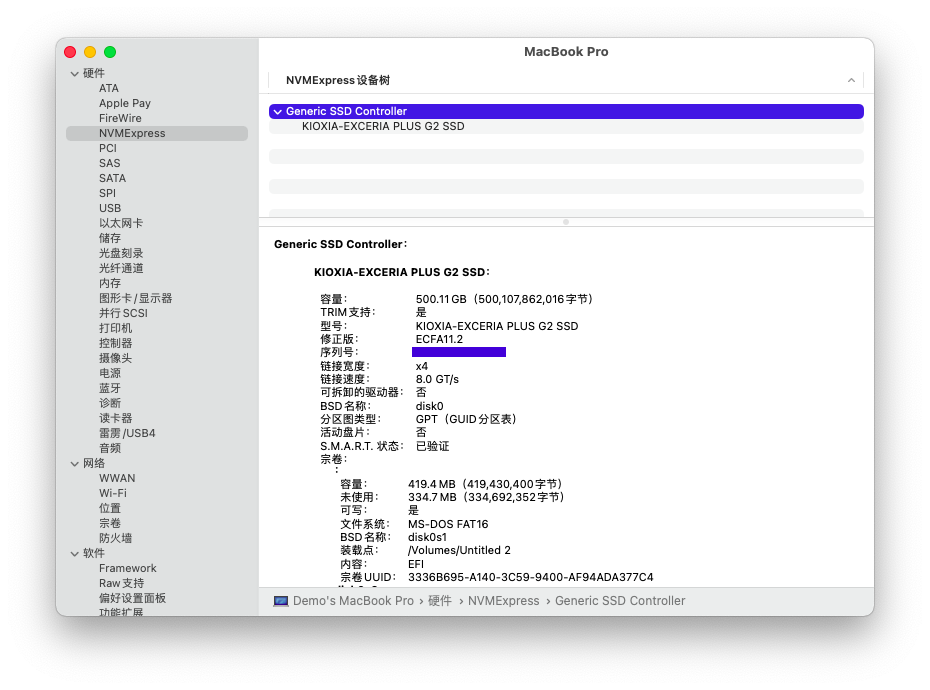

# OMEN-By-HP-15-ax225TX-Hackintosh-EFI | Sveir Dev.

---
English | [Chinese](README.MD)

---

<!-- PROJECT SHIELDS -->

```
 ______  __   __  ______    ________  ______        ______  ______  __   __           
/_____/\/_/\ /_/\/_____/\  /_______/\/_____/\      /_____/\/_____/\/_/\ /_/\          
\::::_\/\:\ \\ \ \::::_\/_ \__.::._\/\:::_ \ \     \:::_ \ \::::_\/\:\ \\ \ \         
 \:\/___/\:\ \\ \ \:\/___/\   \::\ \  \:(_) ) )_    \:\ \ \ \:\/___/\:\ \\ \ \  ___   
  \_::._\:\:\_/.:\ \::___\/_  _\::\ \__\: __ `\ \    \:\ \ \ \::___\/\:\_/.:\ \/__/\  
    /____\:\ ..::/ /\:\____/\/__\::\__/\\ \ `\ \ \    \:\/.:| \:\____/\ ..::/ /\::\ \ 
    \_____\/\___/_(  \_____\/\________\/ \_\/ \_\/     \____/_/\_____\/\___/_(  \:_\/ 
                                                                                 
```


[](https://t.me/sve1r)

<!-- PROJECT LOGO -->
<br />
<p align="center">
  <a href="https://github.com/sve1r/Rules-For-Quantumult-X/">
    
  </a>

  <h3 align="center">OMEN-By-HP-15-ax225TX-Hackintosh-EFI</h3>

  This repository contains the OpenCore-based Hackintosh EFI for the OMEN-By-HP 15-ax225Tx.
   - Latest Supported Version: macOS Monterey 12.5 (21G72)
   - OpenCore Version: OpenCore Release v0.8.3 commit <a href="https://github.com/acidanthera/OpenCorePkg/releases/tag/0.8.3">@c9ba16f</a>
   - Latest Update: 2022-05-20

  **This Project is licensed under the [MIT](LICENSE) License**
</p>


## Content
- [🉑Description](#🉑Description)
- [💻CurrentSpecifications](#💻CurrentSpecifications)
- [⚙️CurrentSituation](#⚙️CurrentSituation)
- [🏙Preview](#🏙Preview)
- [⚠️Issues](#⚠️Issues)
- [🗂Directories](#🗂Directories)
- [❓Questions](#❓Questions)
- [〽️Acknowledgements](#〽️Acknowledgements)
- [🛣License](#🛣License)

-----

# **💻CurrentSpecifications**

| Type | Description | Remark |
|:----:|:----:|:----:|
| ProductModel | OEMN-By-HP-15-ax225TX | Omen 2 Pro Dark-Green
| MotherBoard | HP 8259 |  BIOS Version F.56 Rev.A
| CPU | Intel Core™ i5-7300HQ | 7th Generation Core i5 (Kaby Lake) 
| Memory | 24GB DDR4 2400 Mhz | 8GB + 16GB
| SSD | KIOXIA-EXCERIA PLUS G2 SSD | Change to KIOXIA™ RD20 NVME SSD
| Integrated Graphics | Intel™ Graphics HD630 | PlatformId 0x591b0000
| Graphics | Nvidia™ GTX 1050Ti | Blocked 
| Bluetooth | Intel™ Wireless 7265AC | Supported by [OpenIntelWireless/IntelBluetoothFirmware](https://github.com/OpenIntelWireless/IntelBluetoothFirmware)* 
| Wired Ethernet Adapter | Realtek™ RTL8111 | Works properly
| Wireless Ethernet Adapter | Intel™ Wireless 7265AC | Supported by [OpenIntelWireless/itlwm](https://github.com/OpenIntelWireless/itlwm)* 
| Audio Adapter | Realtek™ ALC295 | AppleAlcID=28

# **⚙️CurrentSituation**

 - The integrated graphics card is working properly, injected with PlatformId 0x591b0000
 - FN button works properly, support brightness adjustment/keyboard light/volume adjustment
 - Audio Device works properly by injecting AppleALC = 77
 - Touchpad support single finger / double finger / three finger gestures
 - Bluetooth works properly
 - ↑ BlueTooth is not tested
 - Wireless Ethernet Adapter works properly by using AirportItlwm
 - ↑ AirDrop is not tested

# **🏙Preview**





# **⚠️Issues**

- **For **unknown reasons** ,it may exist the problem of waking up immediately after sleep when the power line connected*, and this can be solved by **disconnect the power line and closing the lid to sleep** or **just shutting down**
- Due to the HDMI interface uses the discrete graphics card, so you can't use an external monitor by connect to HDMI 
- Touchpad gesture support is achieved through simulation, sometimes it may be wrong
- There is a certain chance that the touchpad driver will fail after updating the system through OTA, which can be solved by reboot 
- Do not enable APFS format on HDD (recommended to install on SSD), Apple's official support for HDD is poor, and it will lead to lag
- The **Config.plist** does not contain any **serial number** and other information, please inject it yourself

# **🗂Directories**

```
Repository
├── /images/                          -> Images
├── /OC/                              -> OpenCore EFI
│  ├── /ACPI/                         -> SSDT
│  │  ├── SSDT-ALS0.aml 
│  │  ├── SSDT-BAT0.aml               -> Battery calibration
│  │  ├── /..../
│  │  ├── SSDT-SBUS-MCHC.aml 
│  ├── /BootStrap/
│  │  ├── BootStrap.efi   
│  ├── /Drivers/
│  │  ├── HfsPlus.efi                 -> HFS disk format support
│  │  ├── OpenCanopy.efi              -> 
│  │  └── OpenRuntime.efi             -> *Required*
│  ├── /Kexts/
│  │  ├── AirportItlwm.kext           -> *Intel Wireless Adpater*
│  │  ├── AppleALC.kext               -> Audio Device
│  │  ├── /..../
│  │  ├── IntelBluetoothFirmware.kext -> *Intel Bluetooth*
│  │  ├── IntelBluetoothInjector.kext -> *Intel Bluetooth*
│  │  ├── VoodooInput.kext            -> TouchPad
│  │  ├── VirtualSMC.kext             -> *Required*
│  │  ├── Lilu.kext                   -> *Required*
│  │  ├── RealtekRTL8111.kext         -> *DO NOT UPGRADE*
│  │  └── WhateverGreen.kext          -> *Required*
│  ├── /Resources/                    -> OpenCore Themes
│  │  ├── /Image                      -> Themes Icon
│  │  └── /Label                      -> Labels
│  ├── /Tools/                        -> OpenCore Tools
│  │  └── OpenShell.efi               -> OpenShell.efi
│  ├── /Config.plist                  -> OC Config
│  └── /OpenCore.efi                  -> EFI
├── LICENSE
└── README.MD
```


# **❓Questions**

>Contributions make the Open Source Community a great place to learn, inspire, and create. Any contribution you make is **very much appreciated**.
Please Open an issue directly if you have questions


# **〽️Acknowledgements**
- [PcBetaForum](http://bbs.pcbeta.com)
- 


# **🛣License**

- All files, READMEs, and other resources in this repository are distributed under a [MIT License](LICENSE), and you may copy and redistribute the contents of this project, but you will have to
  - Use the **EXACT SAME** terms and format for distribution.
  - Please include the original author's information and a notice of agreement.
  - Also, please  **DO NOT** use this project for **commercial purposes**, **any for-profit activity is a commercial use**.
  
- All code for this repository is released under the MIT License unless otherwise noted.

- The text here is for illustrative purposes only and the terms are subject to the contents of the LICENSE document.

- Please use this repository in compliance with the relevant local laws and regulations, and we are not responsible for any problems arising from the use of the content of this repository.
